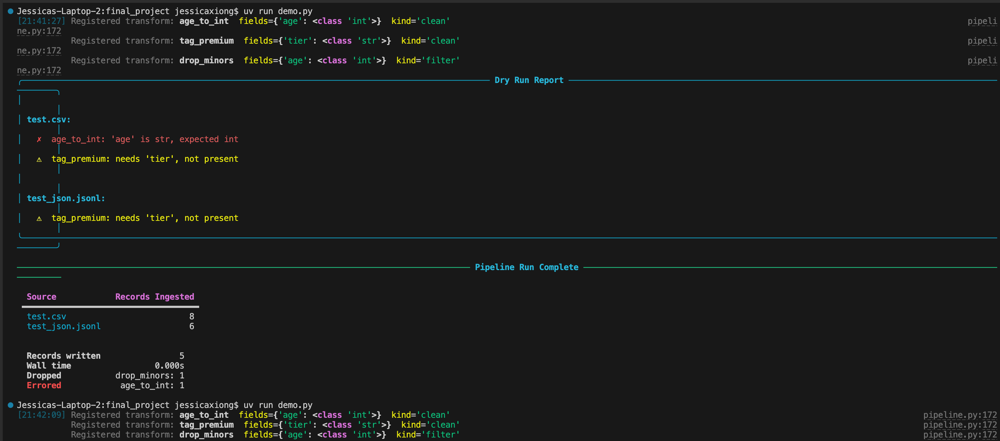
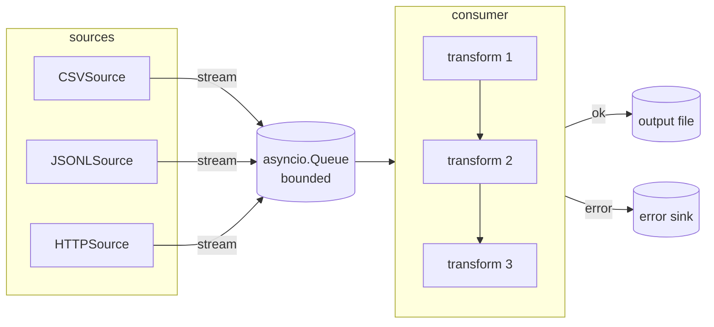

# Async data pipeline: Advanced Python Programming Final Project

My final project is a lightweight async data pipeline for reading, transforming, and writing tabular data. The user gives it sources, registers transforms as decorated functions, and it does the rest by concurrently streaming records through your transform chain into an output sink.

---

## What it does

The core idea comes from one thing I observed that I kept doing while training ML models: I had to clean the data first, and that involved writing a lot of boilerplate code to read a file, loop over rows, apply some functions, and write the results. I wanted to create a tool that handles the plumbing so you can just write the logic.

Concrete use cases: say you have a messy customer export of ages stored as strings, no tier labels, some records with missing fields. You register a few transforms to clean types, tag premium users, and filter out minors. Then, the pipeline tool streams everything through, routes bad records to a separate error file, and prints a clean summary when it's done.

it supports CSV, JSONL, and HTTPS sources, and you can merge multiple sources into one output in a single run.

---

## quickstart

```bash
git clone <repo>
cd final_project
uv sync
uv run pipeline --help
```

requires python 3.11+ and [uv](https://docs.astral.sh/uv/).

---

## usage

### CLI

Run a pipeline over one or more files:

```bash
uv run pipeline run customers.csv signups.jsonl \
  --output cleaned.csv \
  --header name --header age --header tier
```

Validate your transforms against a sample without writing anything:

```bash
uv run pipeline dry-run customers.csv
```



### as a library

```python
import asyncio
from pipeline.sources import CSVSource, JSONLSource
from pipeline.sinks import CSVSink
from pipeline.pipeline import Pipeline

async def main():
    sink = CSVSink("output.csv", headers=["name", "age", "tier"])
    p = Pipeline(sink)
    p.add_source(CSVSource("customers.csv"))

    @p.transform(input_fields={"age": str}, kind="clean")
    def age_to_int(record):
        record["age"] = int(record["age"])
        return record

    @p.transform(input_fields={"age": int}, kind="filter")
    def drop_minors(record):
        if record["age"] < 18:
            return None  # returning None drops the record
        return record

    stats = await p.run()
    stats.print()

asyncio.run(main())
```

---

## Transforms

transforms are registered with a decorator. the `input_fields` dict tells the pipeline what fields the transform needs and what types they should be. the types are used at runtime in `dry_run()` to catch type mismatches before you commit to a full run. so `{"age": int}` means "this transform expects `age` to already be an int, and dry_run will warn you if it's a string."

```python
@pipeline.transform(input_fields={"age": int}, kind="filter")
def drop_minors(record):
    if record["age"] < 18:
        return None  # drop it
    return record   # keep it
```

three things can happen to a record at a transform:

- **skip** : a required field wasn't in the record, so the transform is skipped and the record moves on as-is
- **drop** : the transform returned `None`, meaning you intentionally filtered it out. this is counted in stats.
- **error** : the transform threw an exception. the record gets routed to the error sink if you set one, otherwise it's dropped. also counted in stats.

---

## architecture



all sources run concurrently via `asyncio.TaskGroup` and stream into a queue. a single consumer pulls records off and applies your transforms in order. the bounded queue size (default 20) backpressures the producers so they don't get too far ahead of the consumer.

---

## key design decisions

**error sink instead of crashing**

Early on the question that I had was: what do you do when a transform fails on a record? The real data is messy and one bad row shouldn't kill the run. I discussed this with James in office hours, and the solution he suggested was an optional error sink: bad records get routed there with a note on what failed, so you can inspect them later. if you don't set one, errored records are just dropped and counted in the stats.

**dry run**

Transforms run on real data and type errors only show up at runtime, which means you could start a pipeline over a huge file and only find out 10 minutes in that your `age` field is a string, not an int. dry run solves this by pulling a sample from each source and running your full transform chain against it before anything gets written. it reports skips, type mismatches, and crashes, so the user can fix their issues.

**`input_fields` as a dict, not a list**

the original design just took a list of field names: `input_fields=["age"]`. this let the pipeline check if a field *existed* before passing the record to a transform, but couldn't say anything about types. changing it to a dict `input_fields={"age": str}` meant the pipeline could validate types too, which made dry run actually useful instead of just checking presence.

**skip vs drop vs error**

these are three different outcomes and it was worth tracking them separately. a skip means the data just doesn't have that field, the record still goes through. a drop is intentional (the transform returned `None`). an error means something went wrong. conflating them would make the stats misleading.

---

## running tests

```bash
uv run --group dev pytest
```

type checking:

```bash
uv run --group dev mypy src/
```

---

## project structure

```
src/pipeline/
├── pipeline.py   # core Pipeline class, transforms, dry_run, stats
├── sources.py    # CSVSource, JSONLSource, HTTPSource
├── sinks.py      # CSVSink, JSONLSink
└── cli.py        # typer CLI entrypoint

tests/
├── test_pipeline.py
├── test_sources.py
└── test_sinks.py
```
